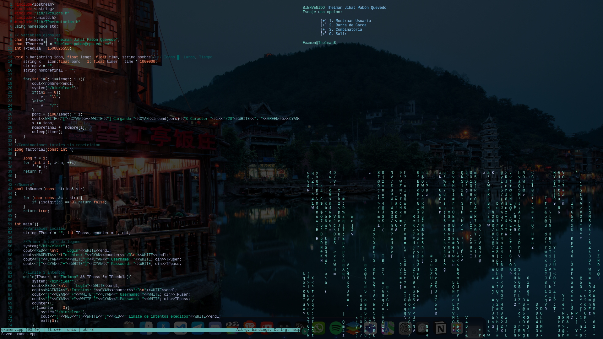

## Examen 1 de programación
Este programa y examen fue realizado por Thelman Pabón
### Programa
LOgueo y menu con ejercicios propuestos
<p align="center">
	
</p>

### Descargar el examen
```git
git clone https://github.com/Alcatraz2033/ExamenProgramacion.git
cd ExamenProgramacion
g++ examen.cpp -o examen (linux)
g++ examen.cpp -o examen.exe (windows)
```

